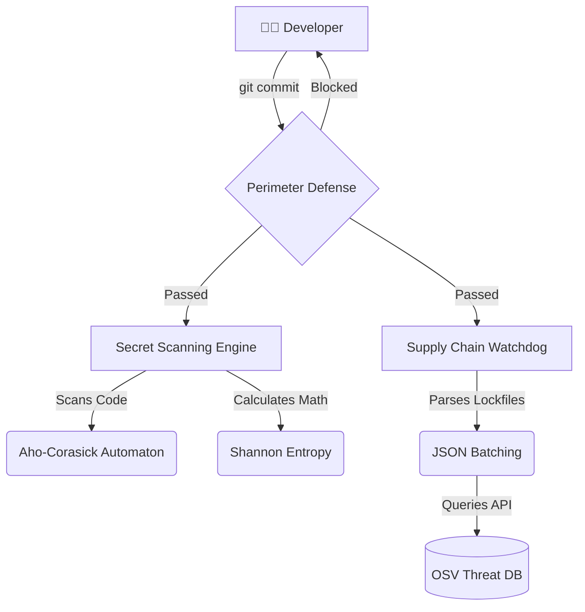

# Core Architecture

Rustywoof is built on three foundational security pillars. Rather than relying on a single method of detection, it uses a layered architecture to secure both your local codebase and your external dependency tree.

Understanding how these systems interact under the hood will help you configure Rustywoof for maximum efficiency in your specific environment.

## Visualize the Defense Flow

## Explore the Three Pillars

-   :material-shield-home:{ .lg .middle } __Perimeter Defense__

    ---

    The proactive barrier. Integrates deeply with Git to stop vulnerabilities at the developer's workstation before they are ever committed.

    [:octicons-arrow-right-24: Grasp Perimeter Defense](perimeter-defense.md)

-   :material-regex:{ .lg .middle } __Secret Scanning Engine__

    ---

    The high-speed text analysis layer. Combines deterministic finite automatons with information theory to find credentials without OOM-killing your CI runners.

    [:octicons-arrow-right-24: Master Secret Scanning](secret-scanning.md)

-   :material-link-lock:{ .lg .middle } __Supply Chain Watchdog__

    ---

    The dependency analysis layer. Actively queries live threat intelligence to catch compromised upstream packages before they are merged.

    [:octicons-arrow-right-24: Secure the Supply Chain](supply-chain.md)

