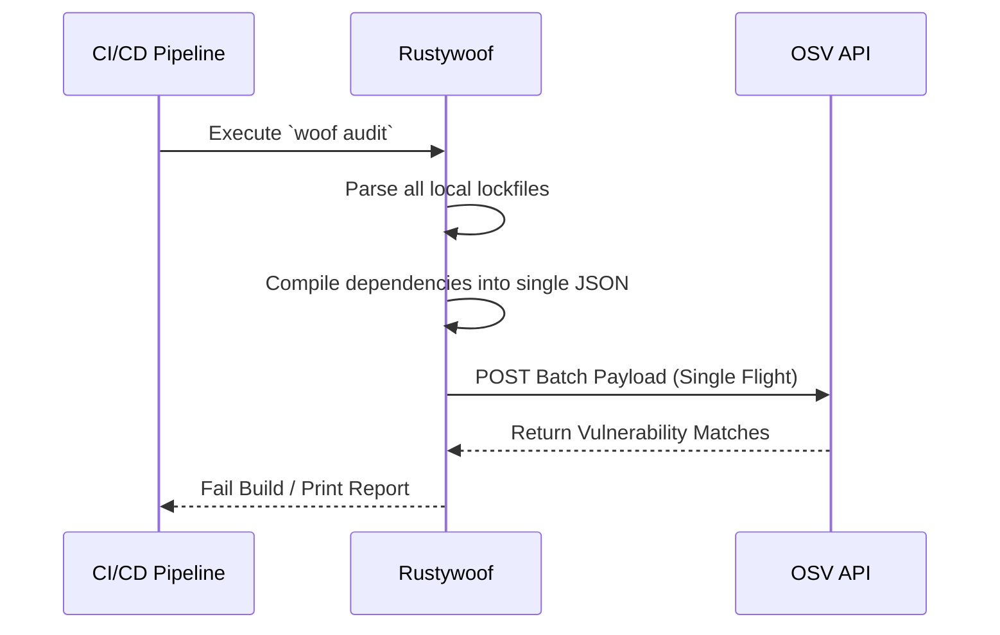

# Secure the Supply Chain

Modern enterprise security doesn't stop at your own code. Supply chain attacks—where bad actors compromise open-source dependencies—are increasingly common and devastating.

Rustywoof's Supply Chain Watchdog proactively defends your perimeter by auditing your project's lockfiles against live threat intelligence from the **Open Source Vulnerability (OSV)** database.

## Query Live Threat Intelligence

Rather than relying on stale, locally cached vulnerability databases, Rustywoof queries Google's OSV API in real-time. This ensures that the moment a zero-day vulnerability in an upstream package is published, your CI pipeline knows about it.

### Optimize with JSON Batching

Querying an API for hundreds of dependencies individually would take tens of seconds, heavily bottlenecking your builds. Rustywoof bypasses this limitation using **JSON Batching**.

1. **Lockfile Parsing:** Rustywoof natively parses your ecosystem's dependency trees to extract exact, locked versions.
2. **Batch Construction:** It compiles these dependencies into a heavily optimized JSON payload.
3. **Single Flight Request:** It sends the batched payload to the OSV API, evaluating the entire dependency tree in a single network round-trip.

!!! info "Performance Metric"
    Thanks to Rust's asynchronous runtime and JSON batching, Rustywoof typically audits massive enterprise lockfiles in **under 500ms**.

### Supported Ecosystems

| Language | Supported Lockfiles |
| :--- | :--- |
| :fontawesome-brands-rust: **Rust** | `Cargo.lock` |
| :fontawesome-brands-node-js: **Node.js** | `package-lock.json`, `yarn.lock`, `pnpm-lock.yaml` |
| :fontawesome-brands-python: **Python** | `poetry.lock`, `requirements.txt` |

## Automate Actionable Remediation

Detecting a vulnerability is only half the battle. When Rustywoof detects a compromised dependency via `woof audit`, it doesn't just fail the build—it provides an actionable remediation path.

By utilizing the `woof remediate` command, Rustywoof can automatically interface with your local package manager to force an upgrade to the nearest safe, non-vulnerable version of the compromised package.

!!! warning "Test After Remediation"
    While `woof remediate` attempts to resolve vulnerabilities safely by preferring minor or patch updates, severe vulnerabilities may require major version bumps that introduce breaking changes. Always run your automated test suite after an automated remediation.

## Maintain Privacy and Data Security

Rustywoof respects your enterprise's privacy. When querying the OSV API, it **only** transmits the names and versions of your public, open-source dependencies. None of your proprietary source code, internal package names, or discovered secrets are ever sent over the network.
